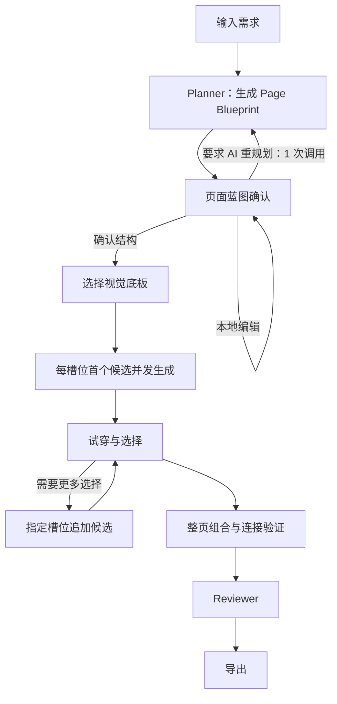

# Relume、OpenUI 与页面蓝图确认研究

研究日期：2026-07-26

## 1. 结论

当前项目已经具备 Planner、LangGraph 并发 Component Agent、流式草图、沙箱编译、候选选择和导出等主要能力。下一步最重要的不是增加更多生成 Agent，而是在 Planner 和 LangGraph fan-out 之间加入正式的“页面蓝图确认”关卡。

核心改动应是：

1. Planner 只产出可编辑的页面蓝图，不立即触发 Component Agent。
2. 用户确认槽位职责、inputs/outputs、槽位依赖、候选数和预计调用量。
3. 页面蓝图确认后再选择视觉底板。
4. 每个槽位首轮只生成一个候选，第二、第三候选按需追加。
5. LangGraph 只接收带有已确认蓝图 revision/hash 的任务。

这样既能避免结构错误扩散到所有候选，也能显著减少 API 浪费。

## 2. Relume 的阶段流程

Relume 的主流程可以概括为：

```text
需求 Brief
→ Sitemap：确定页面范围与信息架构
→ Wireframe：确定页面区块、顺序和基础文案
→ Style Guide：确定颜色、字体与 UI 元素体系
→ 应用到页面、协作确认与导出
```

### 2.1 需求到 Sitemap

Relume 先用几句话描述公司或项目，再生成 Sitemap。这个阶段解决的是：

- 网站包含哪些页面。
- 每个页面的目标与关键内容。
- 项目范围是否合理。
- 是否存在 scope creep。

它不急于决定按钮圆角、颜色或动画。

### 2.2 Sitemap 到 Wireframe

Sitemap 确认后，Relume 将页面转换为无视觉干扰的 Wireframe，并使用真实、可替换的组件区块和基础文案表达结构。

这个阶段的价值是：

- 在视觉设计前完成结构审批。
- 调整区块顺序和内容职责。
- 增删组件而不推翻已完成的视觉稿。
- 让用户而不是 AI 保留最终控制权。

### 2.3 Wireframe 到 Style Guide

结构稳定后，再建立颜色、字体、按钮、表单和卡片等视觉系统。Style Guide 可被统一应用到页面，而不是由每个组件单独猜测风格。

Relume 将该阶段定位为“生成多个视觉概念、选择一个方向、建立完整风格指南并导出”，其价值在于减少细碎视觉决策和提高审批效率。

### 2.4 对当前项目的启发

Relume 最值得借鉴的不是组件数量，而是明确的审批边界：

```text
先确认范围
→ 再确认结构
→ 最后确认视觉
```

当前项目的 Component Agent 不应该同时承担结构推断和视觉生成。页面结构必须先成为一个独立、可编辑、可确认的产品产物。

## 3. 推荐产品流程



### 3.1 页面蓝图确认界面

蓝图确认页应同时呈现：

- 页面列表、路由和每页槽位顺序。
- 每个槽位的职责和明确排除项。
- inputs/outputs。
- 槽位之间的数据和事件连接。
- npm/runtime packages。
- 每个槽位计划生成的候选数。
- 首轮和全部补齐的预计模型调用量。
- 删除、合并、拆分、排序槽位操作。
- 根据蓝图本地绘制的灰阶块状线框。

蓝图线框应由本地 UI 根据槽位顺序、宽度和 kind 绘制，不启动 Component Agent，也不生成可执行代码。

### 3.2 确认后的生成策略

用户确认结构并选择视觉底板后：

1. 每个槽位先并发生成一个主推候选。
2. 完成一个即流式显示一个。
3. 用户可直接选择，也可对指定槽位点击“再来一个”。
4. 不自动为所有槽位补齐三个候选。
5. 新候选仍沿用已确认的职责、接口、视觉底板和 blueprint hash。

## 4. 页面蓝图数据结构

当前 `ComponentContract.dependencies` 实际表示 npm 依赖，但“槽位依赖”也是产品需要表达的重要概念。两者必须拆开。

建议将 PagePlan 升级为 Blueprint v2：

```ts
type PageBlueprint = {
  version: 2
  revision: number
  status: 'draft' | 'confirmed'
  requirement: string
  project: {
    name: string
    description: string
  }
  pages: BlueprintPage[]
  slots: BlueprintSlot[]
  bindings: SlotBinding[]
  estimate: GenerationEstimate
  confirmedAt?: number
  confirmedHash?: string
}

type BlueprintSlot = {
  id: string
  pageId: string
  order: number
  role: string
  responsibility: string
  exclusions: string[]

  kind: 'chrome' | 'section' | 'atomic' | 'controller'
  width: 'fixed' | 'fluid'

  inputs: PropDefinition[]
  outputs: EventDefinition[]

  // 槽位生成或装配依赖。
  dependsOn: string[]

  // 原 dependencies 改名，避免和槽位依赖混淆。
  packages: string[]
  designTokens: string[]

  candidatePolicy: {
    target: 1 | 2 | 3
    variants: CandidateVariant[]
    draftPreview: 'first-only' | 'every-candidate' | 'off'
  }
}

type SlotBinding = {
  id: string
  from: {
    slotId: string
    output: string
  }
  to: {
    slotId: string
    input: string
  }
  transform?: string
}

type GenerationEstimate = {
  plannerCalls: number
  draftCalls: number
  builderCalls: number
  expectedRepairCalls: number
  reviewerCalls: number
  expectedTotal: number
  upperBound: number
}
```

### 4.1 两种依赖关系

`dependsOn` 和 `bindings` 不应混为一谈：

- `dependsOn` 决定生成或装配顺序，必须组成 DAG。
- `bindings` 表达页面运行时的数据与事件连接。

例如筛选器输出 `filtersChanged`，列表消费 `filters`，这是 binding；列表组件生成时是否需要先生成筛选器，则是另一个问题。

### 4.2 蓝图 revision 和 hash

每次编辑蓝图都使 `revision + 1`。确认时计算 `confirmedHash`。

所有候选必须记录：

```ts
type CandidateBlueprintRef = {
  blueprintRevision: number
  blueprintHash: string
}
```

如果用户在生成后重新打开并修改蓝图，应创建新分支或将旧候选标记为 stale，不能静默装配到新结构中。

## 5. 删除、合并和拆分槽位

### 5.1 删除

- 没有入站 binding 时可直接删除。
- 有其他槽位消费其 output 时，必须先删除或重映射连接。
- 同步更新页面槽位顺序和 `dependsOn` 引用。
- 删除前显示调用预算减少量。

### 5.2 合并

- inputs、outputs、packages 和 designTokens 去重合并。
- 两个旧槽位之间的内部 binding 删除。
- 外部 binding 重定向到新槽位。
- 在页面中保留第一个旧槽位的位置。
- 候选目标数采用两者中较大的值，不简单相加。
- 合并后再次检查是否形成职责冲突或循环依赖。

### 5.3 拆分

- 必须为每个新槽位填写独立职责。
- 必须指定共享状态由哪个槽位或 page controller 持有。
- 原 inputs/outputs 必须显式映射到新槽位。
- 如果拆分导致兄弟组件复制同一核心交互状态，应拒绝确认。

以下组件通常保持为原子槽位：

- 计数显示、加减和重置。
- 计算器显示与键盘。
- 播放器画面与控制。
- 表单字段与提交动作。
- 单一计时器或开关交互。

## 6. 候选数量与预计调用量

当前每个候选通常会触发：

- 1 次 Draft Renderer。
- 1 次完整 Builder。
- 编译失败时 0～2 次 Fixer。
- API 失败时可能进行一次任务重试。

基础调用量约为：

```text
1 次 Planner + 2 × 所有候选数量
```

例如 4 个槽位、每槽位 3 个候选：

| 调用 | 数量 |
|---|---:|
| Planner | 1 |
| Draft | 12 |
| Builder | 12 |
| Reviewer | 1 |
| 修复前合计 | 26 |

如果叠加 API 重试和两轮修复，理论上限可接近 74 次。

### 6.1 推荐预算策略

- 首轮每个槽位只生成 1 个候选。
- Draft 只用于该槽位的第一个候选。
- 后续候选只启动 Builder，不重复生成 Draft。
- 导航、页脚和普通工具条默认 1 个候选。
- Hero、核心交互和主要内容区建议目标 2 个。
- 第 3 个实验候选由用户明确开启。

4 个槽位的首轮调用量将变为：

```text
1 Planner + 4 Draft + 4 Builder = 9 次
```

即使最终全部补齐到 3 个候选，也约为：

```text
1 Planner + 4 Draft + 12 Builder + 1 Reviewer = 18 次
```

蓝图确认页应分别显示：

- 首轮预计调用量。
- 全部候选补齐后的调用量。
- 典型修复后的估算。
- 包含重试和最大 Fixer 次数的上限。

## 7. 状态机

建议将 Harness 状态扩展为：

```ts
type HarnessPhase =
  | 'idle'
  | 'planning'
  | 'awaiting_blueprint_confirmation'
  | 'awaiting_direction'
  | 'generating_first_wave'
  | 'selecting'
  | 'generating_more'
  | 'assembling'
  | 'reviewing'
  | 'complete'
  | 'failed'
  | 'cancelled'
```

关键状态守卫：

```ts
chooseDirection()
  requires blueprint.status === 'confirmed'

generateCandidates()
  requires blueprint.status === 'confirmed'
  requires direction !== null

confirmBlueprint(revision)
  requires revision === currentRevision
  requires blueprint validation succeeds
```

不建议让 LangGraph 长时间停在 human interrupt 上等待浏览器用户。当前项目已经有 HarnessSession、IndexedDB 和事件恢复机制，更稳妥的职责划分是：

- HarnessSession 管理用户确认和长生命周期状态。
- LangGraph 只执行确认后的短生命周期并发 batch。
- `generation-graph.ts` 永远收不到未确认的 job。

## 8. OpenUI 机制

研究基于 OpenUI 提交 `42d7ab4ab6650433486dfb12eb3783c393a3e475`，提交日期为 2026-06-30。

### 8.1 多模型适配

OpenUI 后端将不同 provider 统一成 OpenAI 风格的接口：

- 使用 `gpt`、`groq/`、`litellm/`、`ollama/` 等模型名前缀路由 provider。
- 使用 LiteLLM 根据环境变量生成模型配置。
- 将 Ollama 原生消息和 chunk 转成 OpenAI ChatCompletionChunk。
- 最终向前端返回统一 SSE。
- 前端统一使用 OpenAI JavaScript SDK 的异步流接口。

值得复用的抽象是：

```ts
type ModelGateway = {
  listModels?(): Promise<ModelDescriptor[]>
  stream(
    messages: ChatMessage[],
    options: StreamOptions,
  ): AsyncIterable<ModelDelta>
  completeJson(
    messages: ChatMessage[],
    schema: unknown,
    options: CompletionOptions,
  ): Promise<unknown>
}

type ModelCapabilities = {
  streaming: boolean
  vision: boolean
  structuredOutput: boolean
  temperaturePolicy: 'normal' | 'fixed-1' | 'unsupported'
}
```

当前 `BrowserKimiClient` 本质上已经是 OpenAI-compatible client。建议保留实现并逐步改名为 `OpenAICompatibleBrowserClient`，让 Kimi 变成一个配置 profile，而不是核心抽象名称。

### 8.2 流式渲染

OpenUI 的流式链路是：

```text
OpenAI SDK async iterator
→ callback(delta)
→ 累积 Markdown
→ parseMarkdown
→ 1 秒 throttle
→ DOMParser
→ iframe postMessage hydrate
```

可借鉴：

- provider SSE 统一化。
- async iterator 和增量 callback。
- 渲染节流。
- iframe 消息携带实例 ID，并验证 origin。

当前项目已经更强的部分：

- `preview.updated` 等统一事件协议。
- JSON 字段增量解码。
- Draft 和完整源码双流。
- CSP 草图 iframe。
- 编译成功后才允许选择和导出。

因此不应迁移回 OpenUI 的 Markdown 中间格式。

### 8.3 HTML 到 React 等转换

OpenUI 提供两种转换方式：

1. React、Svelte、Web Components 等目标由模型再次转换，输入 HTML，流式返回单文件代码。
2. JSX 快捷模式通过字符串替换将 `class` 改成 `className` 等。

第一种可以参考为独立的 Import/Conversion Adapter。第二种不适合生产使用，因为字符串替换无法可靠处理：

- JavaScript 事件处理器。
- style 字符串到 React style object。
- SVG 属性。
- 布尔属性。
- DOM property 与 attribute 差异。
- 多文件、依赖、类型和状态连接。

当前项目是 React-first，不需要在主生成路径中增加 HTML 到 React。后续如果支持导入 HTML，应让转换结果进入现有的 `CandidateArtifact → schema validation → SandboxRuntime` 流程。

## 9. OpenUI 可复用性判断

| OpenUI 部分 | 建议 |
|---|---|
| OpenAI 风格统一流接口 | 复用抽象 |
| LiteLLM/provider registry | 复用设计，不直接复制硬编码模型 |
| async iterator 到 delta callback | 可复用 |
| iframe ID、origin、postMessage 协议 | 用于增强当前 SandboxRuntime |
| HTML 到任意框架的独立转换器 | P2 参考 |
| Markdown/frontmatter 版本存储 | 不复用，当前事件流和 snapshot 更稳定 |
| `parseMarkdown` 的 HTML 猜测逻辑 | 不复用，源码本身标注为 brittle |
| 字符串式 `htmlToJSX` | 不复用 |
| `fixHTML` 和自动替换图片、音频 | 不复用 |
| 按模型名称前缀硬编码路由 | 已过时，应使用 provider profile/capabilities |
| 固定 4096 token 预算和旧模型清单 | 已过时 |
| `allow-same-origin allow-scripts` 远程 iframe | 不复制；当前 CSP/token 隔离更安全 |

OpenUI 主干的核心生成与解析代码主要形成于 2024 年，2025 年以依赖升级为主，2026 年提交主要是基础设施和安全维护。其整体架构适合研究，但不应整段移植。

## 10. 与当前架构结合

### 10.1 LangGraph

现有 LangGraph fan-out 已经能够按候选 persona 并发分派任务。需要改变的是调用条件，而不是重写图：

- `session.start()` 结束于 `awaiting_blueprint_confirmation`。
- `confirmBlueprint()` 进入 `awaiting_direction`。
- `chooseVisualDirection()` 只启动首轮候选。
- `generateMore(componentId)` 按指定槽位追加候选。
- job 携带 blueprint revision/hash。

### 10.2 BrowserKimiClient

建议增加一层 provider-neutral 接口：

```text
ModelGateway
└── OpenAICompatibleBrowserClient
    ├── Kimi profile
    ├── OpenAI profile
    ├── Groq profile
    ├── Ollama OpenAI-compatible profile
    └── Custom profile
```

不要把 OpenUI 的 Python/LiteLLM 后端作为项目默认依赖，因为这会破坏当前纯前端 BYOK 定位。LiteLLM 应仅作为用户可以选择的兼容代理。

### 10.3 SandboxRuntime

当前 SandboxRuntime 比 OpenUI 更适合作为基础。后续建议：

- `postMessage` 使用明确 target origin；srcDoc 场景继续校验随机 token。
- 增加 `compilePage()`，验证多个已选组件的真实连接。
- 捕获 console error、unhandled rejection 和渲染超时。
- 后续减少 `unsafe-eval` 与运行时 CDN 依赖，或提供离线预打包依赖。

### 10.4 导出层

当前导出层按候选顺序输出 `<section>`，尚未真正消费：

- `pages[].slots`。
- inputs/outputs。
- bindings。
- 页面布局。
- 跨槽位状态。

P1 应生成确定性的 PageController：

```text
Blueprint pages/layout
+ Slot bindings
+ Selected CandidateArtifact
→ React PageController
→ Runtime integrated validation
→ Export
```

导出 manifest 还应包含：

```ts
{
  blueprintVersion: 2,
  blueprintRevision,
  confirmedHash,
  blueprint,
  direction,
  selections,
}
```

## 11. 文件级实施方案

### P0：建立蓝图确认门并减少浪费

#### `app/src/lib/harness/types.ts`

- 新增 `PageBlueprint`、`BlueprintSlot`、`SlotBinding`。
- `dependencies` 改为 `packages`，新增 `dependsOn`。
- Snapshot 升级为 v2。
- 增加蓝图阶段状态和事件。

#### `app/src/lib/harness/schemas.ts`

- 校验槽位引用、binding 端口和重复职责。
- 校验 `dependsOn` DAG。
- 增加 v1 到 v2 migration。

#### `app/src/lib/harness/blueprint-ops.ts`

- 实现 delete、merge、split 和 reorder。
- 确保所有操作保持引用一致性。

#### `app/src/lib/harness/cost-estimator.ts`

- 计算首轮调用量。
- 计算全部候选补齐调用量。
- 计算典型修复估算和最大上限。

#### `app/src/lib/harness/prompts.ts`

- Planner 输出职责、排除项、槽位依赖和候选策略。
- 明确 packages 和 slot dependencies 的区别。

#### `app/src/lib/harness/session.ts`

- 增加 `updateBlueprint()`。
- 增加 `confirmBlueprint()`。
- 增加 `replanBlueprint()`。
- 增加 `generateFirstWave()` 和 `generateMore()`。
- 移除视觉选择后自动补齐全部候选。

#### `app/src/lib/store.ts`

- 新增 blueprint phase、编辑动作、确认动作和预算状态。
- 将 `plan.completed` 映射到蓝图确认界面，而不是视觉方向选择界面。

#### 新增界面组件

- `app/src/components/app/PageBlueprintPanel.tsx`
- `app/src/components/app/SlotContractCard.tsx`
- `app/src/components/app/BlueprintWireframe.tsx`

#### `app/src/components/app/CanvasStage.tsx`

- 在 DirectionPicker 前加入 Blueprint 页面。

#### 测试

- 蓝图未确认时 LangGraph 零调用。
- merge、split、delete 后 binding 保持一致。
- 调用量估算正确。
- snapshot migration 正确。
- 首轮不会自动创建第二、第三候选。

### P1：多模型与整页装配

- 新增 `model-gateway.ts` 和 `model-profiles.ts`。
- 从 BrowserKimiClient 提取 provider-neutral 接口。
- 支持模型能力声明和可选 `/models` 探测。
- LangGraph job 携带 blueprint revision/hash 和调用预算。
- SandboxRuntime 增加整页编译和连接验证。
- 导出层根据 pages、order 和 bindings 生成 PageController。
- 导出完整 blueprint manifest。

### P2：扩展转换与视觉检查

- 新增 `converters/html-to-react.ts`。
- HTML 转换结果复用 CandidateArtifact、schema、沙箱和 Fixer。
- 仅在 provider 无法提供 OpenAI-compatible SSE 时增加专用 adapter。
- 支持蓝图确认后的低保真 wireframe 候选。
- 加入整页截图 Reviewer 和跨槽位可访问性检查。

## 12. 来源

### Relume

- [Relume AI Site Builder](https://www.relume.ai/)：Prompt、Sitemap、Wireframe、Style Guide、协作和导出流程。
- [Relume Style Guide Builder](https://www.relume.ai/style-guide)：颜色、字体、UI 元素概念和审批流程。
- [Relume Sitemap 模式](https://relume.ai/app/project/create?#mode=sitemap)
- [Relume Wireframe 模式](https://relume.ai/app/project/create?#mode=wireframe)

### OpenUI

- [项目定位与多模型支持](https://github.com/wandb/openui/blob/42d7ab4ab6650433486dfb12eb3783c393a3e475/README.md#L13-L31)
- [LiteLLM 配置方式](https://github.com/wandb/openui/blob/42d7ab4ab6650433486dfb12eb3783c393a3e475/README.md#L63-L83)
- [前端流式生成与转换](https://github.com/wandb/openui/blob/42d7ab4ab6650433486dfb12eb3783c393a3e475/frontend/src/api/openai.ts#L81-L253)
- [Markdown/HTML 增量解析](https://github.com/wandb/openui/blob/42d7ab4ab6650433486dfb12eb3783c393a3e475/frontend/src/lib/markdown.ts#L39-L130)
- [DOMParser HTML 处理](https://github.com/wandb/openui/blob/42d7ab4ab6650433486dfb12eb3783c393a3e475/frontend/src/lib/html.ts#L257-L278)
- [节流渲染状态桥](https://github.com/wandb/openui/blob/42d7ab4ab6650433486dfb12eb3783c393a3e475/frontend/src/components/CurrentUiContext.tsx#L31-L70)
- [iframe 预览协议](https://github.com/wandb/openui/blob/42d7ab4ab6650433486dfb12eb3783c393a3e475/frontend/src/components/VersionPreview.tsx#L27-L145)
- [后端 provider 路由](https://github.com/wandb/openui/blob/42d7ab4ab6650433486dfb12eb3783c393a3e475/backend/openui/server.py#L112-L206)
- [OpenAI SSE 标准化](https://github.com/wandb/openui/blob/42d7ab4ab6650433486dfb12eb3783c393a3e475/backend/openui/openai.py#L9-L27)
- [LiteLLM/OpenAI-compatible 配置生成](https://github.com/wandb/openui/blob/42d7ab4ab6650433486dfb12eb3783c393a3e475/backend/openui/litellm.py#L8-L126)
